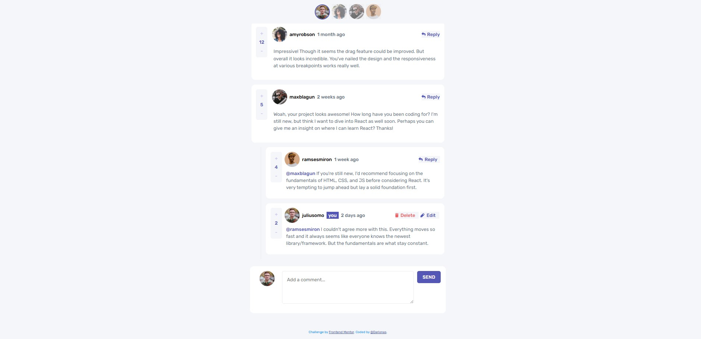

# Frontend Mentor - Interactive comments section solution

This is a solution to the [Interactive comments section challenge on Frontend Mentor](https://www.frontendmentor.io/challenges/interactive-comments-section-iG1RugEG9). 


## Table of contents

- [Overview](#overview)
  - [The challenge](#the-challenge)
  - [Screenshot](#screenshot)
  - [Links](#links)
- [My process](#my-process)
  - [Built with](#built-with)
  - [What I learned](#what-i-learned)
  - [Continued development](#continued-development)
  - [Useful resources](#useful-resources)
- [Author](#author)
- [Acknowledgments](#acknowledgments)


## Overview

### The challenge

Users should be able to:

- View the optimal layout for the app depending on their device's screen size
- See hover states for all interactive elements on the page
- Create, Read, Update, and Delete comments and replies
- Upvote and downvote comments
- **Bonus**: If you're building a purely front-end project, use `localStorage` to save the current state in the browser that persists when the browser is refreshed.
- **Bonus**: Instead of using the `createdAt` strings from the `data.json` file, try using timestamps and dynamically track the time since the comment or reply was posted.

### Screenshot




### Links

- Solution URL: [Interactive comments section solution](https://github.com/Darionas/interactive-comments-section)
- Live Site URL: [Interactive comments section live site](https://darionas.github.io/interactive-comments-section/)

## My process

### Built with

- Semantic HTML5 markup
- CSS custom properties
- CSS Grid
- Mobile-first workflow
- JavaScript (fetch JSON, localStorage)

But created with :heart:

### What I learned

Use ***event delegation*** to handle clicks on owner buttons.
If .owner elements are ever added dynamically, you should use event delegation or re-query them after DOM changes. Event delegation is a technique in JavaScript where you attach a single event listener to a parent element instead of adding individual listeners to each child element. The parent listens for events that bubble up from its children, 
and you use logic to determine which child triggered the event.
Why use it?
  - It improves performance (fewer event listeners).
  - It works for dynamically added elements (children added after page load).
Example:
```js
// Instead of this (many listeners):
document.querySelectorAll('.reply-btn').forEach(btn => {
  btn.addEventListener('click', handleReply);
});

// Use event delegation (one listener on parent):
document.querySelector('.comments-section').addEventListener('click', function(e) {
  if (e.target.matches('.reply-btn')) {
    handleReply(e);
  }
});
```
Event delegation means listening for events at a higher level in the DOM and handling them for child elements as needed.

***Function ownerInteractiveContainer(currentUser) has to be called once***, after the comments and replies are rendered, because it is last and just one element on the page.
Here’s a summary of why this is good:
  - You only render the owner’s comment box once, after all comments and replies.
  - You avoid unnecessary DOM updates and performance issues.
  - The UI will be consistent and predictable.

***Set cursor at the end of text***
***Trap focus inside the modal***

### Continued development

- Continue learning Figma to work with design files

### Useful resources

- [Event delegation 1](https://developer.mozilla.org/en-US/docs/Learn_web_development/Core/Scripting/Event_bubbling) - It requires fewer event listeners, and it works for dynamically added elements.
- [Set cursor at the end of text 2](https://stackoverflow.com/questions/2388164/set-focus-on-div-contenteditable-element/#answer-59437681)


## Author

- Frontend Mentor - [@Darionas](https://www.frontendmentor.io/profile/Darionas)
- GitHub - [Darionas](https://github.com/Darionas)

## Acknowledgments

- Thank you Frontend Mentor team for opportunity to try, practice, train yourself in different level challenges and gain invaluable experience.
